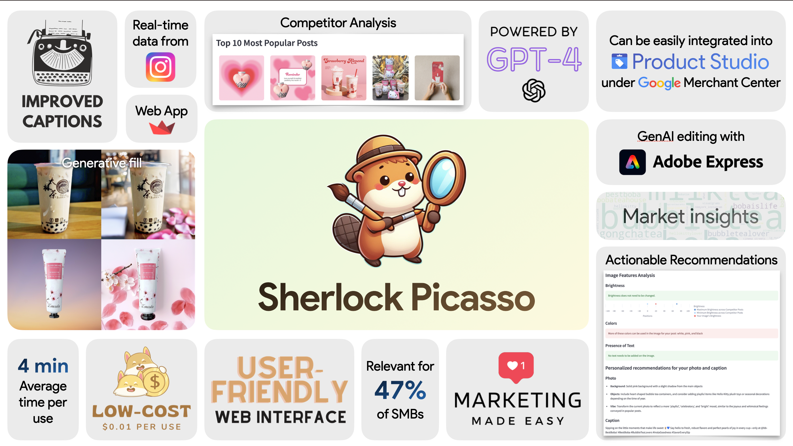

# Sherlock Picasso

Marketing tool for SMBs. Developed as part of Google PM Hackathon.

Team Members: [Jason Jia](https://www.linkedin.com/in/jasonjiajs/), [Maxime Wolf](https://www.linkedin.com/in/maxime-wolf/), [Minnie Arunaramwong](https://www.linkedin.com/in/minnie-arunaramwong/), [Nuobei Zhang](https://www.linkedin.com/in/nuobeizhang/), [Raghav Jayahnthi](https://www.linkedin.com/in/rrmj/)

## Instructions

Create an `api_keys.py` file structured as follows:

```
INSTAGRAM_LOGIN = "your_username"
INSTAGRAM_PASSWORD = "your_password"

OPENAI_API_KEY = "your_api_key"
``````

## Running the App Locally

``` streamlit run streamlit_df.py ```


## Project Description



## Product Demo

https://github.com/maxime7770/Sherlock-Picasso/assets/58089609/1f5b4746-f8a2-4c35-8ed0-13cd5fa475b7

